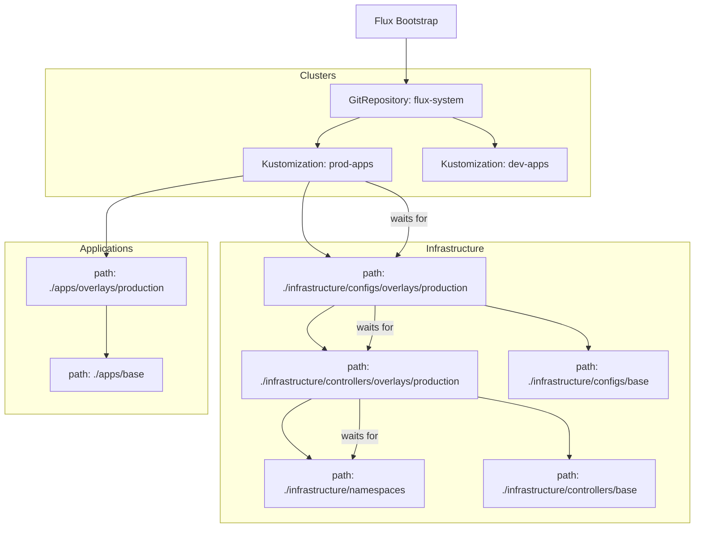

# FluxCD Architecture

This document describes the high-level architecture and dependency chain of the FluxCD setup in this homelab.

## Directory Structure

- **`clusters/`**: Contains cluster-specific configurations. Each subdirectory represents a K8s cluster.
- **`infrastructure/`**: Shared infrastructure components.
  - **`namespaces/`**: Centralized definitions for all Kubernetes namespaces.
  - **`controllers/`**: Operators and controllers (e.g., Cert-Manager, External-Secrets).
  - **`configs/`**: Cluster-wide configurations and custom resources (e.g., ClusterIssuers, SecretStores).
- **`apps/`**: Application definitions.
  - **`base/`**: Common k8s manifests or HelmRelease definitions.
  - **`overlays/`**: Environment-specific overrides (e.g., production, development).

## Dependency Hierarchy

The following diagram illustrates how components are layered and their dependencies:

## Management Best Practices

## Management Best Practices

1. **Bootstrap Phase**: Always start by bootstrapping a cluster using the `flux bootstrap` command pointing to the specific cluster folder (e.g., `./clusters/production`). This folder contains the `kustomization.yaml` that orchestrates the entire cluster state.
2. **Layering**: The execution flow follows a strict linear path: **Namespaces** → **Controllers** → **Configs** → **Apps**.
3. **Overlays**: Use the `overlays/` directory in `infrastructure/` to enable only the controllers and configurations required for a specific cluster.
4. **Visibility**: If a resource (like `infra-namespaces`) is not showing up, verify it is included in the `resources` list of the entry-point `kustomization.yaml` in your cluster folder.
