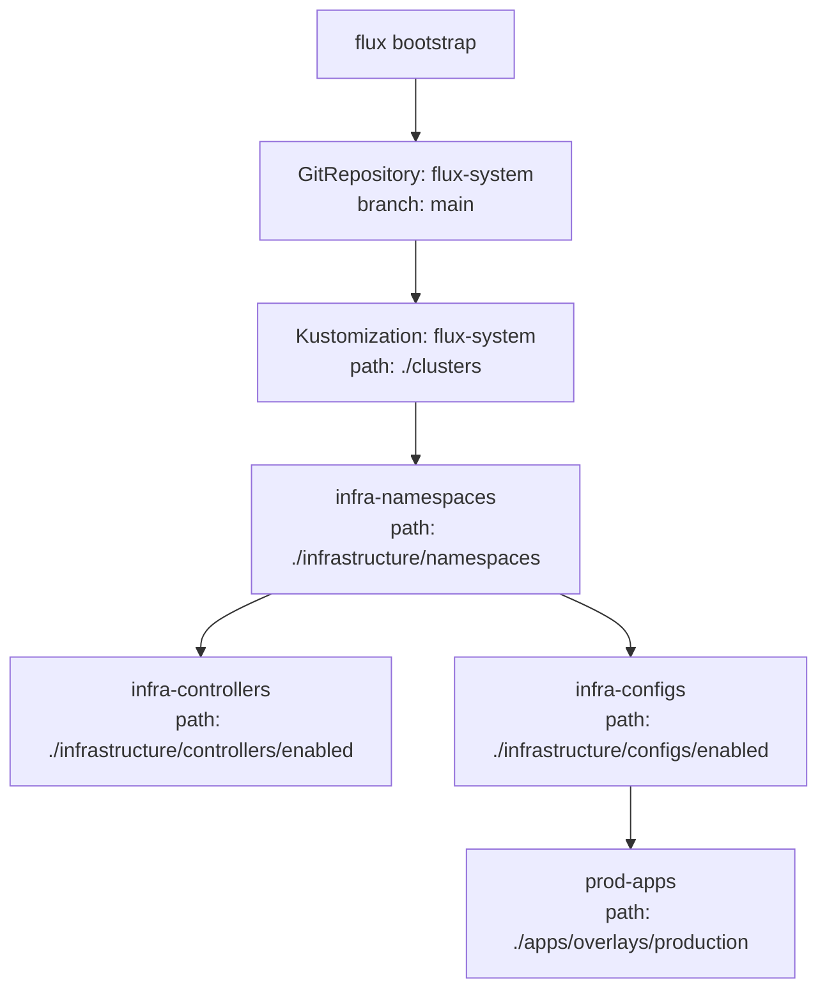
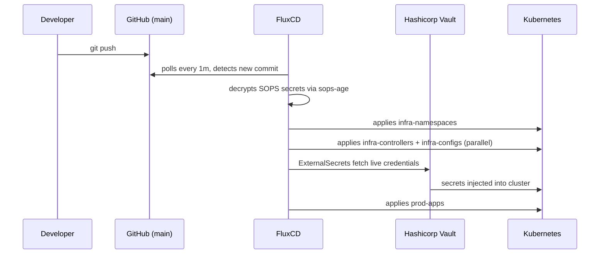

# Kubernetes Homelab

[](https://kubernetes.io/)
[](https://fluxcd.io/)
[](https://www.vaultproject.io/)
[](https://istio.io/)

A production-grade single-node Kubernetes homelab managed entirely through GitOps. Every resource in the cluster — from namespaces to application deployments — is declared in this repository and reconciled automatically by **FluxCD**.

## Hardware

| Component | Spec |
|---|---|
| **Machine** | Dell Optiplex 7th Gen Mini PC |
| **CPU** | Intel i5-7500T (4 Cores) |
| **RAM** | 16 GB |
| **Storage** | 256 GB SSD |
| **OS** | Ubuntu 24.04 |
| **Kubernetes** | v1.31.0 (single-node, kubeadm) |
| **Container Runtime** | containerd |
| **CNI** | Calico |

## Stack

| Layer | Technology |
|---|---|
| **GitOps** | FluxCD |
| **Secret Management** | Hashicorp Vault + External Secrets Operator |
| **Bootstrap Secrets** | SOPS + Age (encrypted in Git) |
| **Gateway / Ingress** | NGINX Gateway Fabric + Istio |
| **Storage** | Longhorn (distributed block storage) |
| **Database** | CloudNativePG (Postgres operator) |
| **Observability** | Prometheus, Grafana, Loki, SigNoz, OpenTelemetry |
| **Policy** | Kyverno |
| **TLS** | cert-manager |
| **Load Balancer** | MetalLB |
| **DNS** | Pi-hole + ExternalDNS |
| **CI Runners** | Actions Runner Controller (GitHub Actions self-hosted) |

## Repository Structure

```
.
├── clusters/
│   ├── flux-system/        # Core Flux components (auto-generated by bootstrap)
│   └── homelab/            # Active cluster — Flux entry point
│       ├── infrastructure.yaml   # infra-namespaces, infra-controllers, infra-configs
│       └── apps.yaml             # prod-apps
├── infrastructure/
│   ├── namespaces/         # All namespace definitions
│   ├── controllers/
│   │   ├── enabled/        # Active Helm releases (Kustomize entry point)
│   │   └── disabled/       # Staged / inactive controllers
│   └── configs/
│       ├── enabled/        # Active CRD-level configs
│       └── disabled/
└── apps/
    ├── base/               # Base manifests / HelmRelease templates
    └── overlays/
        ├── production/     # Active production overrides
        └── development/
```

## Flux Dependency Hierarchy

Resources are applied in a strict order enforced by `dependsOn` across four Kustomization objects defined in `clusters/homelab/`.



- `infra-namespaces` has no dependencies and runs first.
- `infra-controllers` and `infra-configs` both depend on `infra-namespaces` and reconcile in parallel.
- `prod-apps` waits for `infra-configs` before deploying applications.

## Infrastructure

### Controllers (`infrastructure/controllers/enabled/`)

| Category | Controllers |
|---|---|
| Storage | `longhorn`, `cloudnativepg` |
| Networking | `metallb`, `nginx-fabric-gateway`, `external-dns` |
| Secrets | `hashicorp-vault`, `external-secrets` |
| Security | `cert-manager` |
| Observability | `monitoring` (kube-prometheus-stack), `metrics-server` |

### Configs (`infrastructure/configs/enabled/`)

CRD-level resources for: `metallb` (IPAddressPool, L2Advertisement), `cert-manager` (ClusterIssuer), `external-secrets` (ClusterSecretStore), `cloudnativepg` (ImageCatalog, GCS backup), `nginx-fabric-gateway` (Gateway), `longhorn` (BackupTarget), `monitoring`, `hashicorp-vault` (HTTPRoute).

## Applications (`apps/overlays/production/`)

| App | Description |
|---|---|
| `minimaldo` | Custom full-stack todo app (FastAPI + React + CloudNativePG) |
| `fastapi-app` | FastAPI service with ServiceMonitor for Prometheus scraping |
| `mlflow` | ML experiment tracking with CloudNativePG backend |
| `onyx` | AI-powered knowledge base / RAG platform |
| `n8n` | Self-hosted workflow automation |
| `sonarqube` | Static code analysis and quality gates |
| `owasp-dependency-track` | SBOM analysis and supply chain vulnerability tracking |
| `signoz` | Distributed tracing and APM (OpenTelemetry-native) |

## Secret Management

Two layers of secret management work together:

**Hashicorp Vault + External Secrets Operator** — runtime secrets for applications. Apps reference `ExternalSecret` objects that pull live credentials from Vault. The Vault token itself is bootstrapped via SOPS.

**SOPS + Age** — secrets that must be committed to Git (e.g., Vault token, image pull secrets, DB passwords for bootstrap). Encrypted at rest; Flux decrypts in-cluster using the `sops-age` Kubernetes Secret.

## GitOps Workflow


